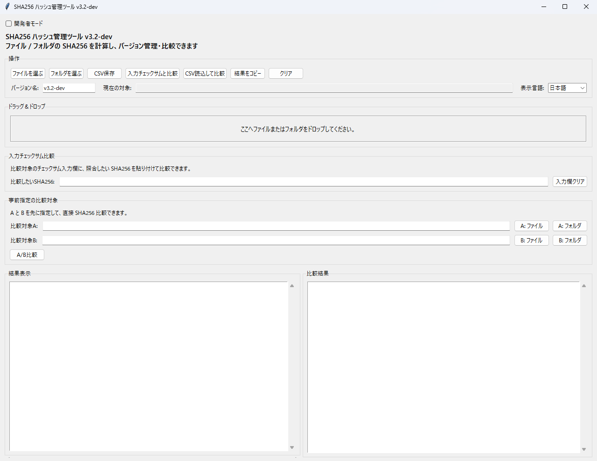
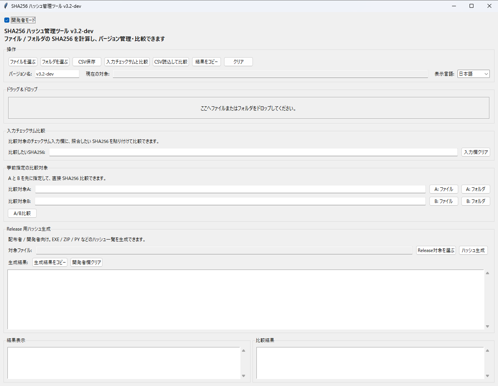

# hash_viewer_gui

A GUI tool for viewing and comparing SHA256 hashes (JP/EN)

## Download / ダウンロード

👉 [Download Latest Release](https://github.com/hiro1960486/hash_viewer_gui/releases/tag/v3.2-dev)

※ 上のリンクをクリック → ページ下の「Assets」から ZIP ファイルをダウンロードしてください  
*Click the link above, then download the ZIP file from the "Assets" section.*

## Screenshot / スクリーンショット

### Normal Mode（通常モード）

ファイル単体のハッシュ確認やCSV出力が可能です。

### Developer Mode（開発モード）

バージョン比較や詳細なハッシュ確認に対応しています。

---

**Language:** [🇯🇵 日本語](#japanese) | [🇺🇸 English](#english)

---

## Japanese

### 概要

このツールは SHA256 ハッシュ値の表示、CSV 保存、バージョン比較を行うための GUI アプリケーションです。  
日本語 / English UI 切替、ドラッグ＆ドロップ操作をサポートします。

### 特徴

- ドラッグ＆ドロップ対応
- スタンドアロン EXE (Python 不要)
- SHA256 ハッシュ表示
- CSV 保存
- バージョン比較
- 日本語 / 英語 UI 切替

### 使い方

1. 配布ZIPを展開し、`hash_viewer_gui_dev.exe` を実行  
2. ファイルをドラッグ＆ドロップ  
3. 結果が表示されます  

### ビルド方法

`tools/99_build.bat` を実行してください。

既存のPython環境で `PyInstaller` と `tkinterdnd2` が必要です。新しいEXEは `dist/build_v3.2-dev/hash_viewer_gui_dev.exe` に生成されます。動作確認済みの配布ZIPは維持されます。

### バージョン履歴

- v3.2 初版（テンプレート適用）

---

## English

### Overview

This tool is a GUI application for displaying SHA256 hash values, saving CSV files, and comparing versions.  
It supports Japanese/English UI switching and drag & drop operations.

### Features

- Drag & Drop support
- Standalone EXE (no Python required)
- SHA256 hash display
- CSV saving
- Version comparison
- Japanese / English UI switching

### Usage

1. Extract the release ZIP and run `hash_viewer_gui_dev.exe`  
2. Drag & drop files  
3. Results will be displayed  

### Build

Run tools/99_build.bat.

### Version History

- v3.2 Initial release (template applied)

---

## License / ライセンス

This project is licensed under the MIT License.  
本プロジェクトは MIT ライセンスのもとで公開されています。

## Repository structure / 構成

- `src/v3.2-dev/`: application source / ソース
- `tools/99_build.bat`: Windows build / ビルド
- `dist/Release_v3.2-dev.zip`: verified distribution / 動作確認済み配布ZIP
- `dist/Release_v3.2-dev_hash.txt`: distribution SHA256
- `docs/`: documentation / 説明
- `assets/images/`: screenshots / 画面画像

2026-09-30: Repository build path and documentation repaired. Application source and verified release are unchanged.

## FileWorkbenchとの連携（2026-10-06）

[FileWorkbench](https://github.com/hiro1960486/FileWorkbench) Ver.0.7.0にSHA256一覧・CSV比較・A/B比較・入力ハッシュ照合・配布用出力を追加しました。CSVはv3.2-devの列構成に対応し、照合結果を重複整理、選択行をリネーム・タグ登録・任意退避へ渡せます。

この独立アプリのソースとv3.2-dev配布物は保持します。FileWorkbenchは現在非公開です。英語切替と開発用表示を含む独立版の完全移植ではありません。
